# Migração de dados de sistema legado para Arquitetura baseada em AWS. 

## 1 - Criação de um serviço AWS RDS para simular o banco de dados legado com PostgreSQL.

Para simular o banco de dados legado com os dados de venda, foi escolhido o PostgreSQL. Esta escolha se deve pelo fato de ser um banco de dados robusto e com suporte a recusos avanaçados, o que faz com que seja amplamente utilizado em soluções antigas como base de dados transacional, se encaixando bem em nosso cenário de sistema legado.

Para utilizar o PostreSQL, foi criada uma instância RDS (*Relational Database Service*) com a engine de PostgreSQL na AWS. É uma maneira rápida de subir uma instância de banco de dados, e é posssível utilizar a Free Tier, ou seja, conseguimos usar o serviço de maneira gratuita nos primeiros 12 meses, porém claro, com algumas limitações de tempo e quantidade de armazenamento (ver detalhes da free tier do Amazon RDS em: [AWS Free Tier](https://aws.amazon.com/pt/free/database/?gclid=CjwKCAiAxea5BhBeEiwAh4t5K_hUmCg8HoSgZQZ84us-S2XTNEBRRDXr_lQhP0-gGr38IwehFtILjhoC8k0QAvD_BwE&trk=eca03f9c-ce0f-4704-b08e-e6fe66f1f54d&sc_channel=ps&ef_id=CjwKCAiAxea5BhBeEiwAh4t5K_hUmCg8HoSgZQZ84us-S2XTNEBRRDXr_lQhP0-gGr38IwehFtILjhoC8k0QAvD_BwE:G:s&s_kwcid=AL!4422!3!548640877199!p!!g!!amazon%20web%20services%20database%20services!12024809973!118832470289)). 

Para a criação da instância é necessário:

### 1.1 - Na barra de pesquisa da AWS, digitar "RDS" e clicar nesse serviço.

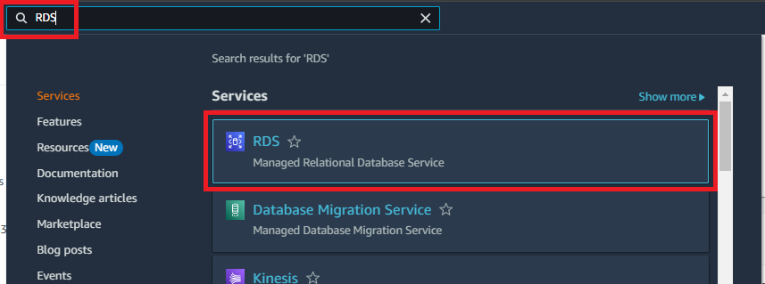

### 1.2 - Na tela de resumo dos recursos RDS, deve-se clicar em "Create database".

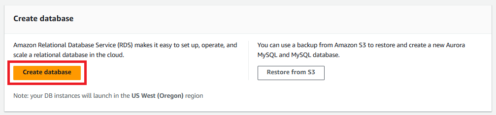

### 1.3 - Como já mencionado, para este projeto, será criado uma instância padrão, com a engine PostgreSQL.

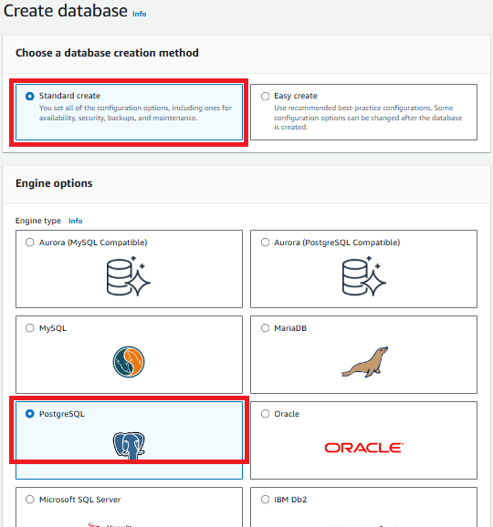

### 1.4 - A seguir, deve-se selecinar as configurações desejadas, com especial atenção ao "Credential Settings", onde deve-se criar uma senha de acesso ao Database. Ao fim da página de configurações, deve-se criar em "Create database".

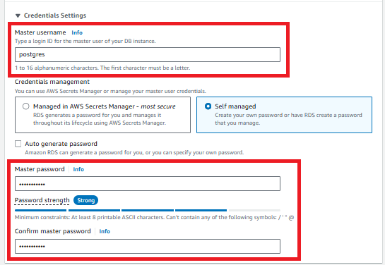

### 1.5 - Depois de alguns minutos, a instância será criada e estará disponível.

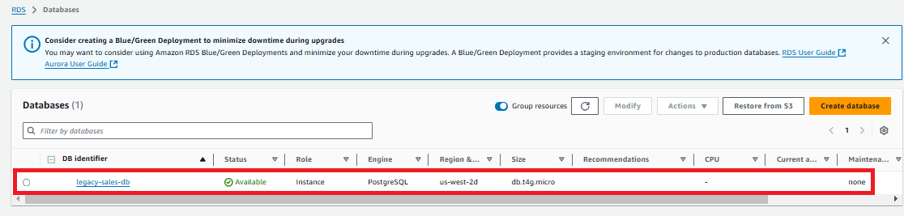

## 2 - Ingestão de dados no PostgreSQL.

Para a ingestão dos dados no database criado, serão utilizados 2 scripts Python. O primeiro ```01_create_db.py``` irá criar o banco de dados "legacy_sales_db" caso este não exista, e o script ```02_create_and_populate_tb.py``` irá criar a tabela "sales". e inserir os dados de vendas (500 registros). Os scripts podem ser encontrados em ```scripts/```.

Nota-se que os dados de acesso ao PostgreSQL (host, port, username, password etc.) estão sendo importados de outro arquivo 'config.py', o qual foi inserido no .gitignore. Isso é uma boa prática para evitar que dados sensíveis sejam compartilhados no repositório. 

Como resultado da execução desses 2 scripts, temos a inserção dos dados no PostgreSQL. 

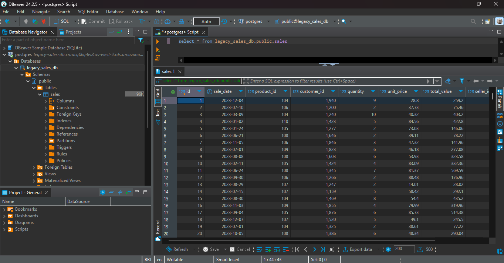

 **IMPORTANTE**: *Para a visualização dos dados na instância PostgreSQL, foi utilizado o DBeaver, uma aplicação de software cliente SQL que permite a administração de bases de dados, suportando diferentes SQL e No-SQL databases. O download do DBeaver pode ser feito em: [DBeaver Download](https://dbeaver.io/download/)*.

## 3 - Migração dos dados para camada RAW.

Para o desenvolvimento do projeto, decidiu-se simular os buckets do S3 (Simple Storage Service) em um diretório local. Trata-se do folder 's3' neste repositório.

Decidiu-se utilizar a Arquitetura Medallion na organização dos dados no S3 por facilitar a governança, rastreabilidade e auditoria dos dados. Também em ambientes colaborativos onde diferentes equipes utilizam diferentes camadas de dados (dados brutos, transformados, agregados etc.), essa arquitetura se mostra bastante eficiente. Além disso tudo, é ideal para escalabilidade dos dados de maneira confiável e organizada. 

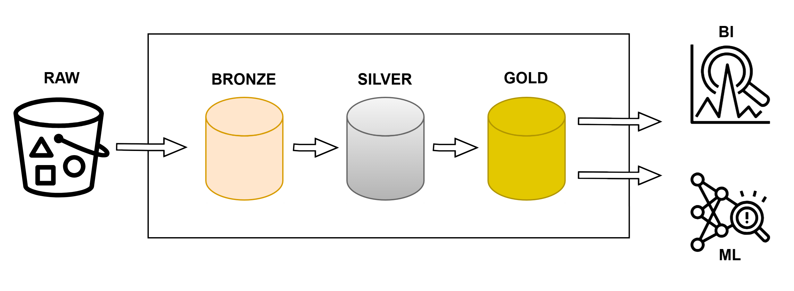
        
As camadas utilizadas são: 
1. **RAW**: Mantém os dados originais em formato CSV.
2. **BRONZE**: Realizada uma cópia dos dados da camada RAW com partições por ano, mês e dia, e salvando arquivos em formato parquet.
3. **SILVER**: Realizada um limpeza e enriquecimento dos dados. No caso deste projeto, foi realizado a conversão das datas para formato ISO e feito a remoção de dados duplicados
4. **GOLD**: Implementado o modelo dimensional **tabelas fact e dimension**. Realizada também a agregação dos dados com vendas por dia (data, valor total de venda e quantidade total de produtos).

Para fazer a movimentação dos dados da nossa instância PostgreSQL para a camada RAW, utilizou-se o código Python ```03_export_to_raw.py```. Esse código faz a consulta dos dados no banco relacional, e em seguida faz a escrita desses dados no formato CSV no diretório ```s3/raw```, simulando a ingsetão de dados em um bucket do S3.

**IMPORTANTE**: *Neste projeto, foram criados 4 folders dentro de S3, sendo 1 para cada camada. Dessa maneira, se fosse aplicado no S3, cada camada seria um Bucket. Entretanto também é comum criar um único Bucket S3 e dividir as camadas em Folders dentro deste Bucket. No mercado é comum encontrar ambas as maneiras de organizar os dados.*

Portanto, nessa etapa, foram movimentados os dados do RDS para a camada RAW to Data Lake, conforme mostrado na imagem abaixo.

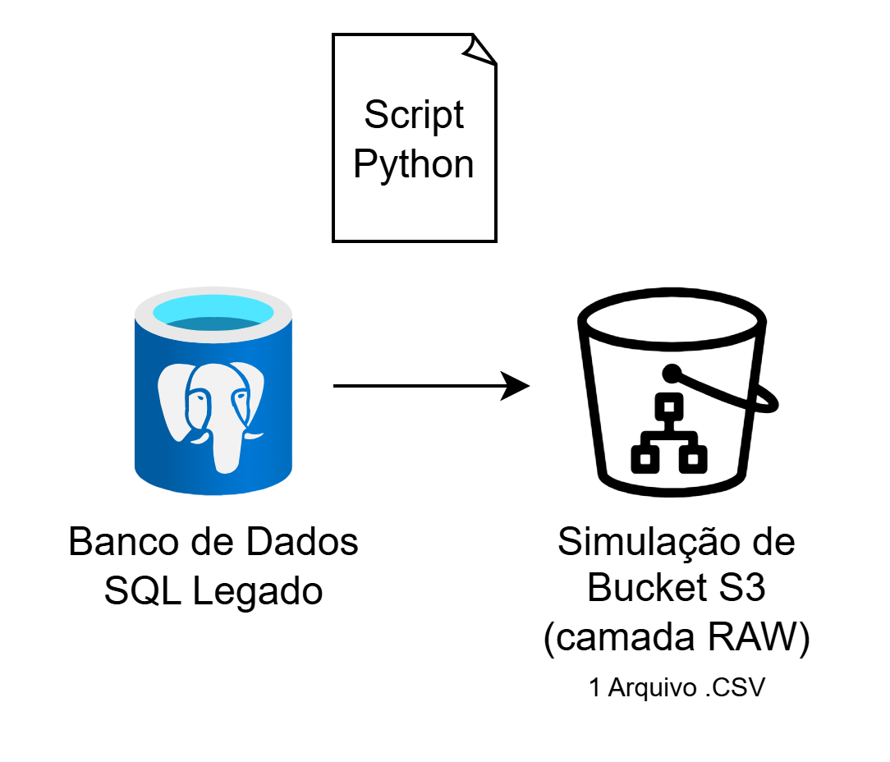

## 3 - Migração da camada RAW para camada BRONZE.

Os dados da camada BRONZE serão exatamento os mesmos da camada RAW, porém será aplicada a partição por ano, mês e dia. Para isso, foi criado o script Python ```04_raw_to_bronze.py```.

Rodando o código Python, os dados são lidos da camada RAW, particionados e salvos na camada BRONZE em formato parquet, como mostrado abaixo. Nota-se que existe a separação por ano, mês e dia. Essa partição é uma excelente prática para melhorar performance das consultas e escalabilidade. 

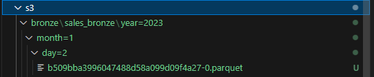

Portanto, implementando essa etapa, nosso projeto se encontra na configuração abaixo. 

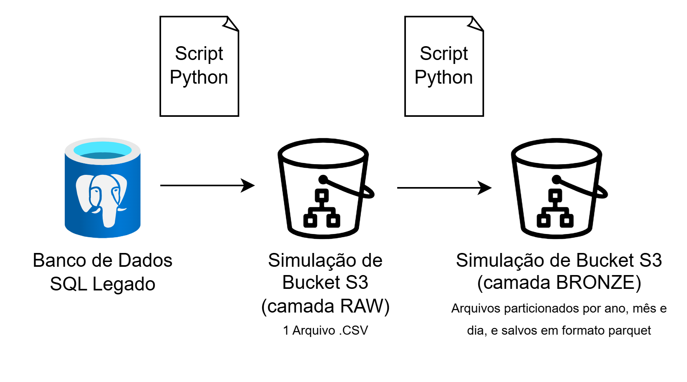

## 4 - Migração da camada BRONZE para camada SILVER.

Por definição da Arquitetura Medallion, da camada Bronze para camada Silver os dados devem ser limpos e enriquecidos. Para este projeto, criou-se um código Python (```05_bronze_to_silver.py```) que coloca a data em formato ISO. A ISO 8601 define como padrão de data o formato YYYY-MM-DD. Mais informações sobre essa padronização podem ser encontradas em [ISO 8601](https://www.iso.org/iso-8601-date-and-time-format.html). Além disso, nosso código Python também remove duplicatas. 

Como a camada Silver é uma etapa intermediária, com dados que frequentemente são utilizados como insumos para a camada analítica Gold, geralmente esta camada não é utilizada diretamente para análises ou consultas de baixa latência, portanto é comum em alguns casos encontrarmos a camada Silver sem partição nos dados, economizando o esforço para manter a consistência entre as partições e evitando a adição de complexidade desnecessária ao pipeline de ETL. Simulando este cenário, consolidamos os dados da camada silver em um único arquivo parquet (sales.parquet).

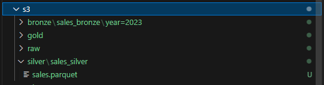

Portanto, implementando essa etapa, nosso projeto se encontra na configuração abaixo. 

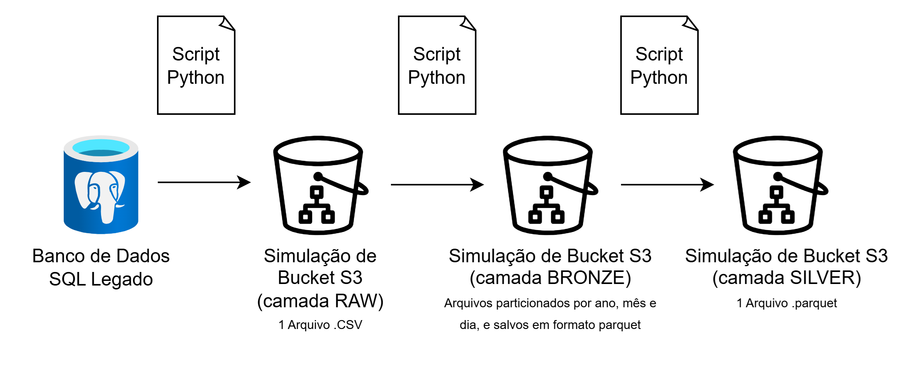

## 5 - Migração da camada SILVER para camada GOLD.

Para a camada Gold, realizou-se 2 processamentos. O primeiro deles foi a modelagem dos dados no modelo dimensional, criado-se os arquivos:
-  ```dim_customer.parquet```
-  ```dim_date.parquet```
-  ```dim_product.parquet```
-  ```dim_seller.parquet```
-  ```fact_sales.parquet```

A modelagem dimensional na camada Gold é fundamental para organizar os dados de forma intuitiva e otimizada, simplificando consultas e análises diretas em ferramentas de BI. Com tabelas fato e dimensionais, ela melhora o desempenho de consultas, garante consistência nos relatórios e reduz a complexidade analítica ao armazenar dados enriquecidos e pré-agregados. Essa abordagem fornece uma estrutura clara para análises rápidas, flexíveis e escaláveis, apoiando a tomada de decisões estratégicas com dados confiáveis e de fácil acesso

O segundo processamento realizado foi a agregação dos dados em vendas por dia, consolidando o valor total de venda e quantidade total de produtos vendidos, mantendo esses dados particionados por ano, mês e dia, e salvos em formato parquet.

Para ambos os processamentos, o código Python criado foi ```06_silver_to_gold.py```.

Portanto, implementando essa etapa, nosso projeto fica com a configuração abaixo. 

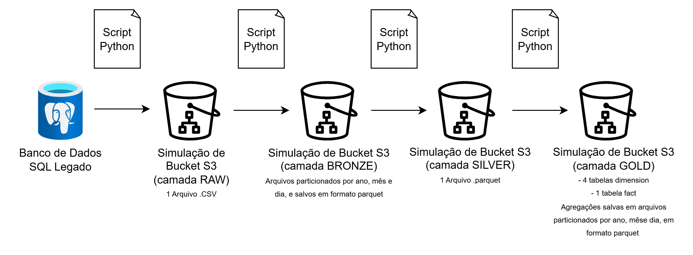

## 6 - Analise das vendas diárias.

Para entender o desempenho de vendas por mês, foi criado o código ```07_sales_months_analysis.py```. Esse código visa percorrer os dados de daily sales da camada Gold, e faz o resumo mensal dos dados.

Como resultado, temos os resultados mostrados abaixo.

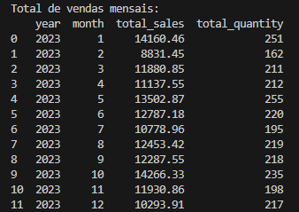

## 7 - Script SQL para a consulta no Athena.

Para consultar tabelas armazenadas no S3 utilizando Athena, é necessário registrar as tabelas no AWS Glue Data Catalog. Para isso, seria necessário:
    
- Configurar um Glue Crawler para detectar automaticamente os esquemas dos arquivos parquet da camada Gold e registrar as tabelas no Glue Data Catalog. Para este projeto, vamos considerar apenas os arquivos do modelo dimensional (tabelas Dimensão e Fato).

- Com as tabelas disponíveis no Glue Catalog, é possível utilizar o Athena para executar queries SQL e consumir esses dados. Para monitorar consultas e verificar erros ou problemas de desempenho, é possível habilitar o AWS CloudWatch Logs, e conecta-lo ao SNS (Simple Notification Service) para receber as notificações de erro no e-mail por exemplo. Em ```scripts/monthly_sales.sql``` é possível encontrar uma query SQL que pode ser utilizada no Athena. Essa query faz uma consolidação dos dados do modelo dimensional, armazenados na camada Gold.

## 8 - Alinhamento da solução com Arquitetura Moderna AWS.

Tudo o que foi desenvolvido durante este projeto pode ser reproduzido utilizando apenas serviços nativos da AWS. Utilizamos o RDS como banco de dados legado, com a engine PostgreSQL rodando a instância. A migração dos dados desse DB para o S3 poderia ser feita utilizando uma ferramenta CDC (Change Data Capture), como DMS (Database Migration Service), ou até mesmo utilizando o Glue ETL. Uma vez que os dados estivessem no S3, poderia ser feita a migração entre camadas, e transformações dos dados com o Glue ETL. O Job no Glue poderia ser disparado através de algum evento específico, utilizando o Lambda. Para organizar os dados poderiamos utilizar o Glue Crawler para identificar o schema dos dados e criar os Databases e Tabelas no Glue Catalog. Para consulta dos dados com SQL, seria possível utilizar Athena, e para criação de Dashboards, poderiamos facilmente utilizar o Quicksight. Portanto, uma arquitetura de solução utilizando apenas serviços nativos da AWS poderia ser o mostrado abaixo.

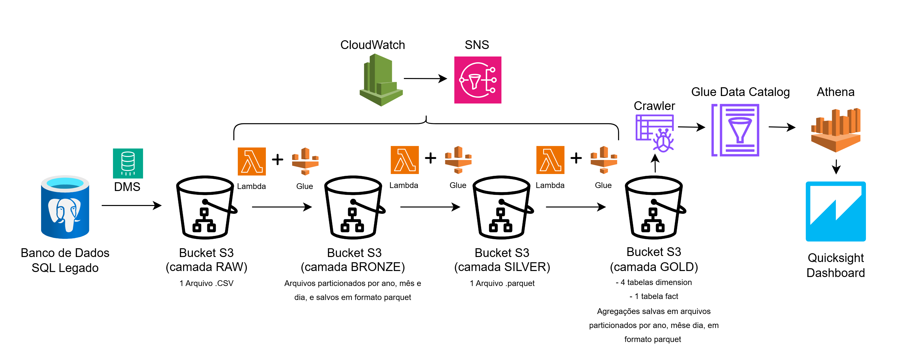

## 9 - Mock-up de dashboard com insights chave dos dados de vendas.

Para a proposta de solução de dataviz, criou-se um mock-up de um dashboard de análise de vendas mensais, organizado em seções que incluem filtros e visualizações. Os filtros permitem selecionar dados com base em datas, produtos específicos e regiões. A visão geral é apresentada por meio de cards que destacam o total de vendas (em R$), a quantidade de itens vendidos, e a média de vendas por transação. O documento ainda sugere a inclusão de gráficos, como um gráfico de barras para vendas por produto e um gráfico de linhas para tendências ao longo do tempo, visando facilitar a análise e a tomada de decisões. O arquivo com o mock-up pode ser encontrado em ```docs/mock-up_dash.md```.

## 10 - Proposta de modelo de machine learning para implementar com AWS SageMaker.


Criou-se uma proposta para o desenvolvimento de um modelo de Machine Learning no Amazon SageMaker para prever vendas futuras com base em dados históricos. O objetivo é auxiliar na identificação de tendências, no planejamento de estoques e recursos, e na melhoria de campanhas de marketing. Os dados necessários serão extraídos da camada Gold, incluindo informações como vendas passadas, categorias de produtos, regiões e sazonalidades. O projeto abrange desde a preparação dos dados até a implementação e avaliação do modelo, com foco em análise preditiva e integração ao pipeline de negócios. O arquivo com a proposta pode ser encontrado em ```docs/ml_proposal```.